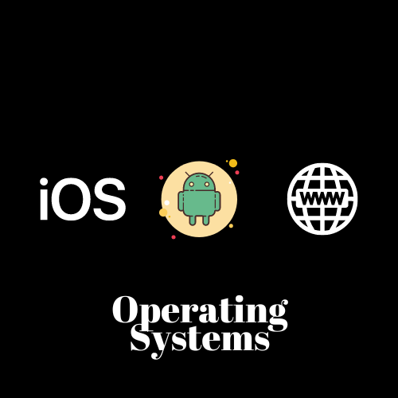
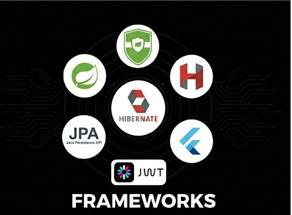
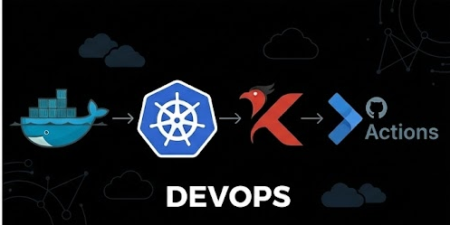
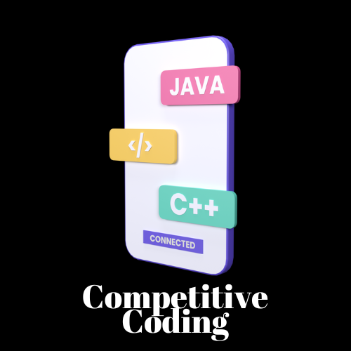

# 🌟 Welcome, I'm Avinash Milind Mane! 🌟

Greetings! I'm a passionate **Software Developer — Backend (Java + Spring Boot)** with experience in building secure, scalable backend systems powering **CE-certified medical applications used globally**.  
My mission is to create impactful software solutions that are scalable, reliable, and engineered with clean architecture.

  
 
 
 
 

---

## 🚀 About Me

  

I’m a **Software Developer (Backend)** currently working with **Java, Spring Boot, MongoDB/PostgreSQL**, and integrating backend systems with **Flutter, React, and JavaScript clients**.

I specialize in building:
 Secure REST APIs  
 Offline-first sync systems (diff-sync + payload optimization)  
 Modular backend components for clinical decision tools  
 Performance-optimized backend logic (Improved overall performance by **25%**)  

I strongly believe in writing clean, maintainable code and solving real-world problems using scalable system design.

---

## 💼 Current Work

### **Software Developer — Backend (Java + Spring Boot)**
📍 Pune, Maharashtra | **Oct 2024 – Present**

- Developing and maintaining backend services powering Flutter-based medical applications.
- Implementing secure REST APIs and modular components for clinical decision tools (IDSA, EAU, Rheuma, EHA).
- Built offline-first sync mechanisms using diff-sync strategies and versioned API endpoints.
- Optimized server-side logic, improving app load and API response performance by **25%**.
- Designed and maintained MongoDB/PostgreSQL schemas with strong validation & consistency checks.

---

## 🌐 Core Competencies

- **Java Development:** Building scalable & efficient backend systems using Java and Spring Boot.
- **Backend Engineering:** REST API design, secure authentication (JWT), modular architecture, scalable services.
- **Full Stack Exposure:** Integration with React and JavaScript clients along with backend systems.
- **Mobile Integration:** Supporting Flutter apps with backend services and offline-first sync workflows.
- **Database Expertise:** MongoDB, PostgreSQL, MySQL, Firestore — schema design + optimization.
- **Performance Optimization:** Caching, query tuning, async execution for improved response times.
- **Continuous Learning:** Staying updated with modern backend development, best practices, and architecture patterns.

---

## 🧰  Tech Stack

 **Languages:** Java, Dart, JavaScript (basic), C++, Python (basic), SQL  
 **Frontend:** React, Responsive UI  
 **Backend:** Spring Boot, REST API Design  
 **Mobile:** Flutter, BLoC, Clean Architecture, In-App/WebView content rendering  
 **Databases:** MongoDB, PostgreSQL, MySQL, Firestore  
 **Cloud/Tools:** Firebase (Auth, FCM, Firestore), Git/GitHub, CI/CD (basic), Docker (basic)

---

 

  

---

<!--## 🏆 GitHub Trophies

## 📊 GitHub Stats

--- -->

|               |           |
|       ---     |    ---    |
| |             |
| |    |
| |     |
| |      |
| |     |
| |                 |
| |  <!--  -->   | 

---

## 🌱 What Sets Me Apart

- **Problem-Solving Abilities:** Tackling complex challenges with attention to performance, stability, and clean design.
- **Effective Communication:** Collaborating smoothly in teams and cross-functional environments.
- **Innovation & Growth:** Always eager to learn, build, and improve as a developer.

  

---

## 📫 Let's Connect!

  

---

🔗 **Join me on my journey as a Backend & Full Stack Developer!**  
Let’s connect, collaborate, and build scalable software solutions that make a real-world impact. 🚀

